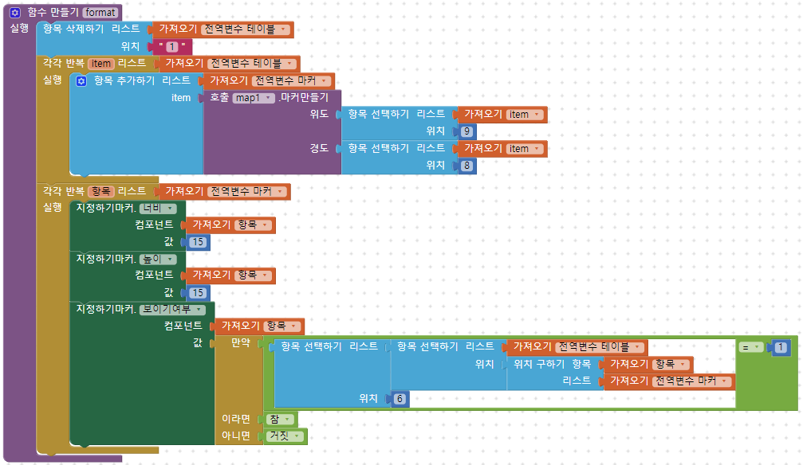
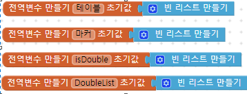
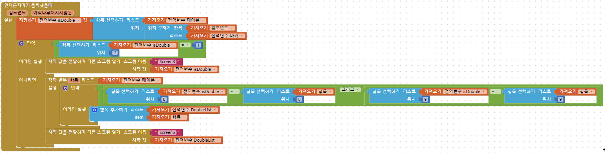
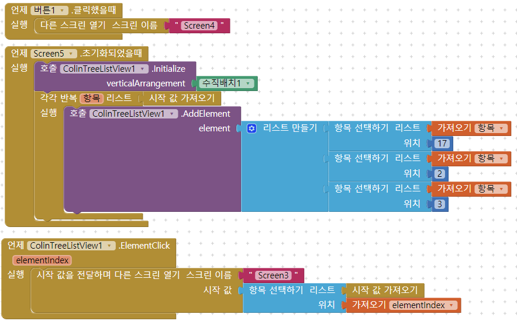

# 2020. 02. 14 Fri 회의 내용 (19:00 ~ 21: 00)

### 회의 내용

- 마커의 크기 설정기능 구현 완료
- 마커의 위치에 여러개의 공연장이 있는지 없는지를 판단해서 공연장을 띄워주거나 리스트뷰를 띄워줌
- 다음주까지 검색 최대한 해보고 알려주기

### 다음주까지 해볼 내용

- 여태까지 한것을 토대로 디자인 혼자 만들어보셔도 되고 디자인 틀을 만들어오셔도 됩니다.
- 검색기능을 못넣을 것을 대비하여 추가로 넣고싶은 기능이 있다면 멘토에게 즉시 알려주기.
- 오류 해결해보기
- 현재까지의 블록 구조 및 흐름 이해

### 블록 코딩 - 노트북 전원꺼지고 에러 못잡은거 이거보고 해결해보세요!

- 보기전 알아두어야 할 것 멘티님의 엑셀파일과 저의 엑셀파일이 약간 달라서 숫자를 볼때 제꺼해서 **-1**을 해주시면 멘티님의 블록코딩에 들어가야할 숫자가 됩니다. 이 점 유념해 주세요! 단 조건 값의 1은 count안에 있는 1이기 때문에 1로 조건문안의 1은 빼지 않으셔도 됩니다!

  궁금한 부분 있으시면 카톡으로 바로 물어봐주세요!

- 마커 만드는 함수

  - 

- 전역변수 4개
  - 

- 마커를 클릭했을때 중복인지 아닌지 검사하고 내용을 보여주는 블록
  - 

- 새로만든 리스트뷰 화면 
  - 