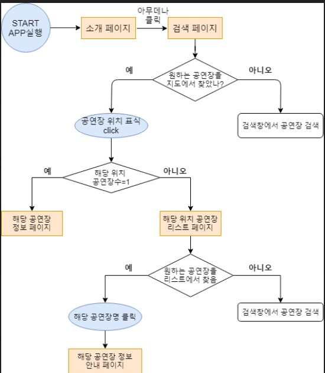

# 2020. 02. 08 Sat 회의 내용 (19:00 ~ 20: 00)

### 회의 내용

- 앱 인벤터 구현 중 화면 전환, 맵에 마커 나타내서 정보를 보여주기를 완료하였음.
- 앱 인벤터로 디자인 툴이 따로 있는지 알아봐야함
- 추가적으로 구현해야할 기능을 검색기능, 중복위치 리스트 기능으로 압축함.

### 다음 주까지 완성되어야 할 것

- 오븐을 활용한 디자인 완성, 흐름도 수정
- 오늘 만든 블록 구조 및 흐름 이해
- 중복 리스트 구현 (멘토)

### 

### 세번째 회의 까지 완성된 중간 완성본

- [자료- 링크 클릭후 Download버튼 누르면 다운됩니다.](./자료/Third_meeting.aia)

### Flow Chart

